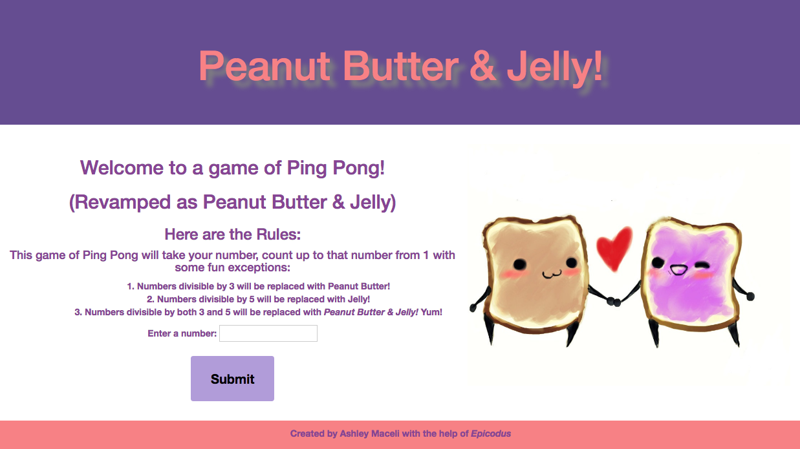
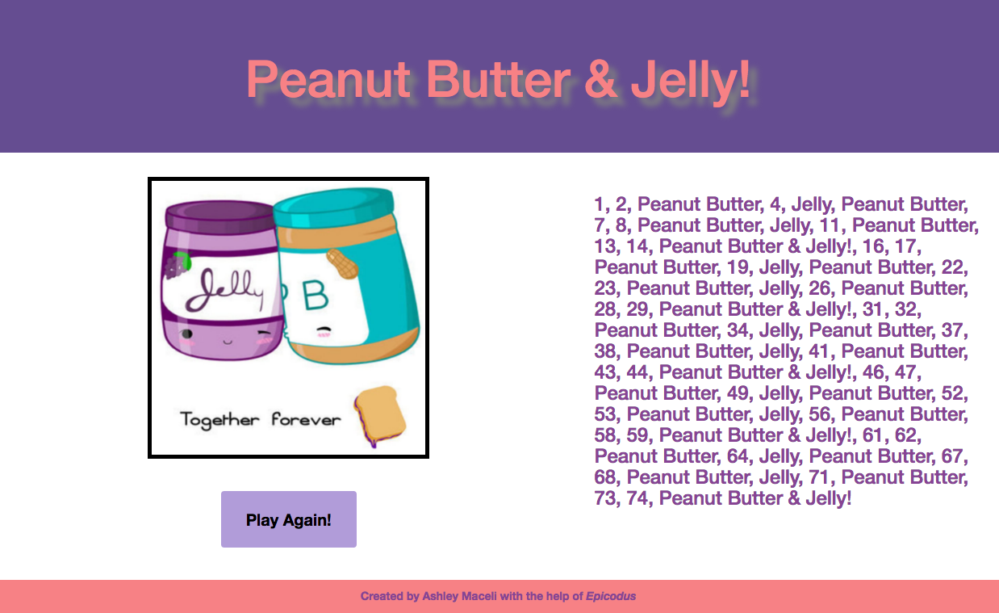

# _Ping Pong Game!_

#### _Webpage made with HTML, CSS, Bootstrap, JavaScript and jQuery. Current version last edited: April 1st, 2016_

#### By _**Ashley Maceli**_

## Description

_Epicodus Intro to Programming Week 3 independent project. Created a Ping Pong game webpage but changed it to "Peanut Butter and Jelly". With the use of JavaScript, jQuery, loops and branching with if/else statements in a for loop the user may input a number. The numbers will be counted out from 1 to the input number. Numbers evenly divisible by 3 return "Peanut Butter", numbers divisible by 5 return "Jelly" and if divisible by both numbers it returns "Peanut Butter and Jelly!" otherwise it just returns the number._

## GitHub Pages Link

http://ashleyraymaceli.github.io/ping-pong/

## Known Bugs

* _If user picks a large number, the user must scroll all the way back to the top to press the Play Again button._
* _One if/else statement in user interface logic to alert user if what they are entering is NaN or a negative number. When added to the business logic it would continue through to the result page. By putting it in the user interface logic it will stop the program before it gets to the main function. Main function is still created in business logic and called on in user interface logic._

## Support and contact details

_Please contact Ashley via e-mail with issues_
_ashley.maceli@gmail.com_

## Technologies Used

_HTML, CSS, Bootstrap, JavaScript, jQuery_

### License

The MIT License (MIT)

Copyright (c) [2016] [Ashley Maceli]

Permission is hereby granted, free of charge, to any person obtaining a copy
of this software and associated documentation files (the "Software"), to deal
in the Software without restriction, including without limitation the rights
to use, copy, modify, merge, publish, distribute, sublicense, and/or sell
copies of the Software, and to permit persons to whom the Software is
furnished to do so, subject to the following conditions:

The above copyright notice and this permission notice shall be included in all
copies or substantial portions of the Software.

THE SOFTWARE IS PROVIDED "AS IS", WITHOUT WARRANTY OF ANY KIND, EXPRESS OR
IMPLIED, INCLUDING BUT NOT LIMITED TO THE WARRANTIES OF MERCHANTABILITY,
FITNESS FOR A PARTICULAR PURPOSE AND NONINFRINGEMENT. IN NO EVENT SHALL THE
AUTHORS OR COPYRIGHT HOLDERS BE LIABLE FOR ANY CLAIM, DAMAGES OR OTHER
LIABILITY, WHETHER IN AN ACTION OF CONTRACT, TORT OR OTHERWISE, ARISING FROM,
OUT OF OR IN CONNECTION WITH THE SOFTWARE OR THE USE OR OTHER DEALINGS IN THE
SOFTWARE.
